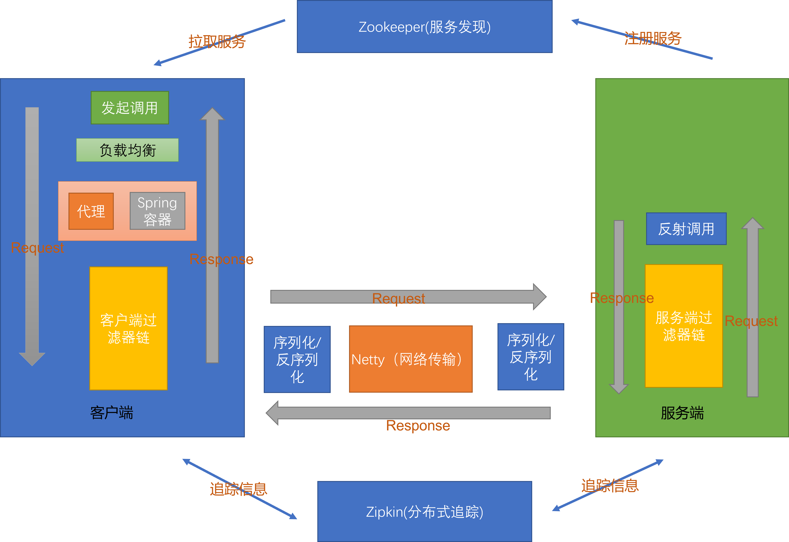

# trpc

# 介绍
Trpc是一个分布式rpc框架。

特点：
- 基于netty的网络io，高效通信
- 基于curator的服务发现
- 负载均衡
- 多种序列化方式，可更换序列化
- 融合spring，具有spring boot starter，方便快速开发
- 基于zipkin的分布式追踪，可视化观察链路
- 异常处理
- netty的心跳机制
- 借鉴了retrofit的调用方式，支持同步、future、回调
- 抽象的请求和响应，能够自定义各种请求、响应进行通信，便于扩展各种应用场景。例如批次调用同一方法
- 请求和响应使用过滤器模式进行处理，用户可添加自定义过滤器

# 软件架构


# 快速开始
## 样例
examples目录下

## 安装
### spring boot
如果你的项目使用spring boot，这是你的最佳选择
1. 下载trpc-spring-boot-starter-xx.jar
2. 将该jar加入到类路径

### spring
如果你的项目使用spring
1. 下载trpc-core-xx.jar
2. 将该jar加入到类路径

## 使用
### 前提
1. zookeeper已启动, zookeeper 3.7

### spring boot
1.扫描TrpcService接口

@TrpcServiceScan的basePackages中指定TrpcService接口所在的包

```java
@SpringBootApplication
@TrpcServiceScan(basePackages = "tong.trpc.examples.order_example.common")
public class OrderApp {

    public static void main(String[] args) {
        SpringApplication.run(OrderApp.class, args);
    }

}
```

2.在resources下增加trpc.properties，配置如下
```properties
connectZkStr=127.0.0.1:2181
trpcServicesBasePackage=tong.trpc.examples.order_example.common
serviceName=order
serverAddress=127.0.0.1
serverPort=8005
balancePolicyClassName=tong.trpc.core.discovery.RoundRobinPolicy
#connectZkStr zookeeper的连接地址
#trpcServicesBasePackage trpc服务的基包，用于初始化服务缓存，提前从服务中心拉去服务缓存起来
#serviceName trpc服务端的服务名
#serverAddress trpc服务端的地址
#serverPort trpc服务端的端口
# balancePolicyClassName 负载均衡算法的实现类，不填则是默认实现
```
3.添加TrpcService

- TrpcService接口名需要以Trpc开头，但是对应的业务接口不已Trpc开头。
- TrpcService接口的方法的返回值需要用TrpcInvocation包裹。
- TrpcService接口和业务接口需要在相同的包下，通过有无Trpc前缀区分
```java
@TrpcService(serviceInstanceName = "product")
public interface TrpcProductService {

    TrpcInvocation<Product> getProduct(Long productId);
    
}
```
对应的业务接口不已Trpc开头
```java
public interface ProductService {

    Product getProduct(Long productId);

}

@Service
@Slf4j
public class ProductServiceImpl implements ProductService {
    @Override
    public Product getProduct(Long productId) {
        Product product = new Product();
        product.setProductId(productId);
        product.setName(String.format("Name[%s]", product.getProductId()));
        product.setDesc(String.format("Desc[%s]", product.getProductId()));
        product.setPrice(10);
        log.info("查询到{}", product.toString());
        return product;
    }
}
```
4.使用

```java
@Autowired
private TrpcProductService productService;

@PostMapping("/createOrder")
public Order createOrder(@RequestBody Order order) {
        ...
        Product product = productService.getProduct(order.getProductId()).sync();
        ...
}
```

### spring
跟spring boot的步骤基本一致。

不同点
- 1.需要手动启动TrpcServer
- 2.需要手动将tong.trpc.core包纳入spring管理
```java
@SpringBootApplication(scanBasePackages = {"tong.trpc.core", "tong.trpc.examples.order_example"})
@TrpcServiceScan(basePackages = "tong.trpc.examples.order_example.common")
public class OrderApp {

    public static void main(String[] args) {
        SpringApplication.run(OrderApp.class, args);
        TrpcStarter.run();
    }

}
```

### 分布式追踪
#### 前提
1.zipkin启动，zipkin-server-2.24.0

#### 开启步骤
trpc.properties增加以下
```properties
traceEnable=true
zipkinUrl=http://localhost:9411/api/v2/spans
```

# 自定义请求处理
请阅读[自定义请求处理](./doc/custom-request.md)